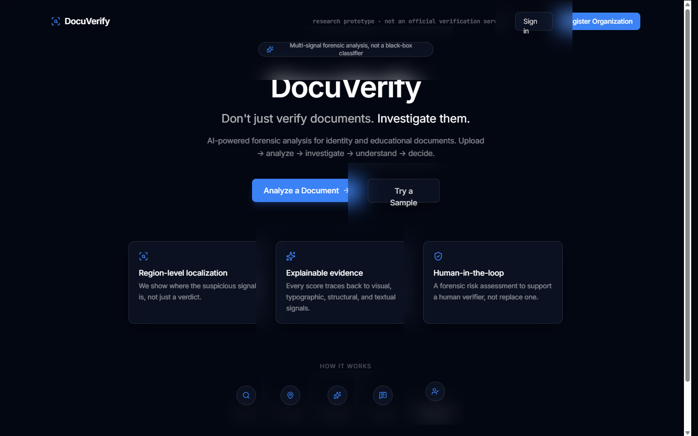
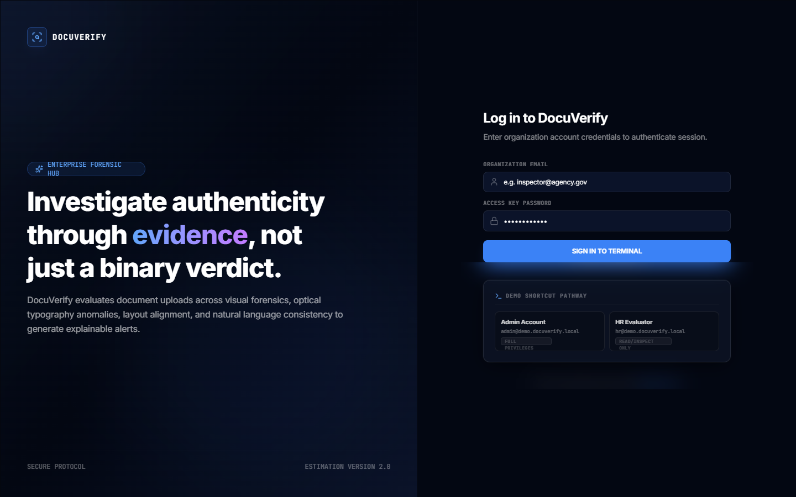
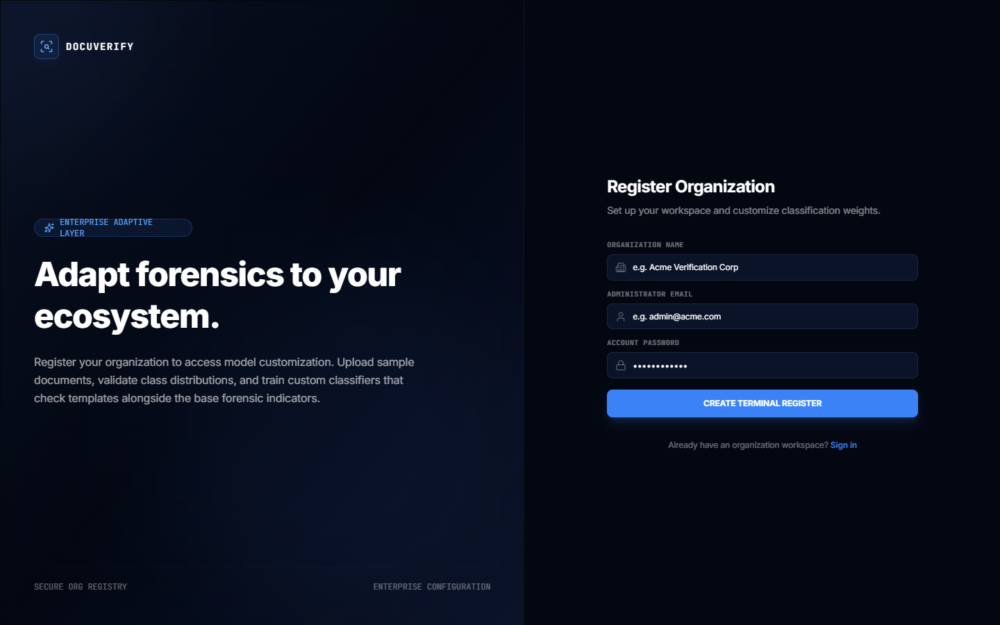
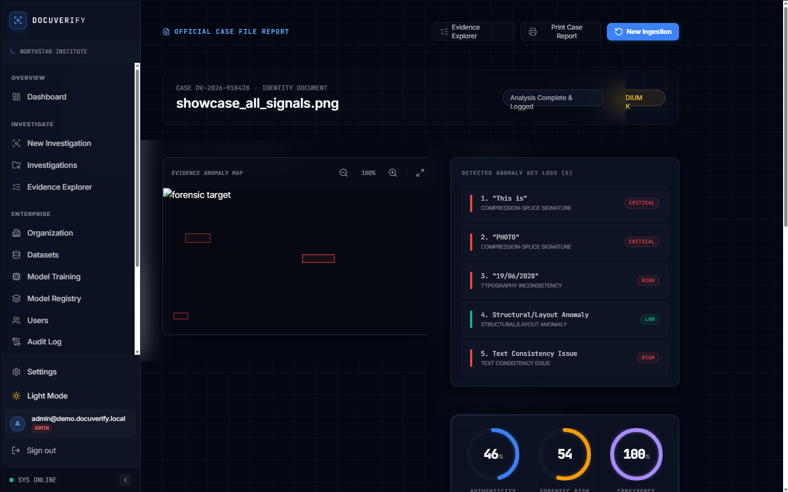
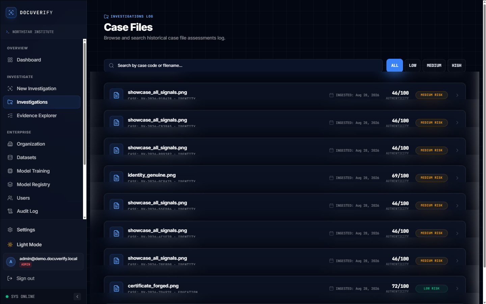
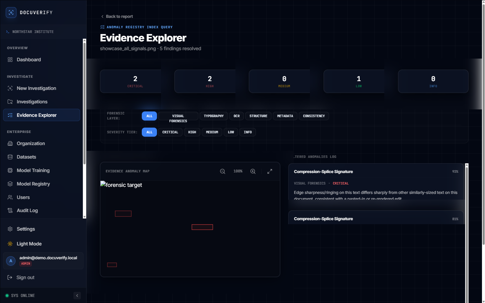
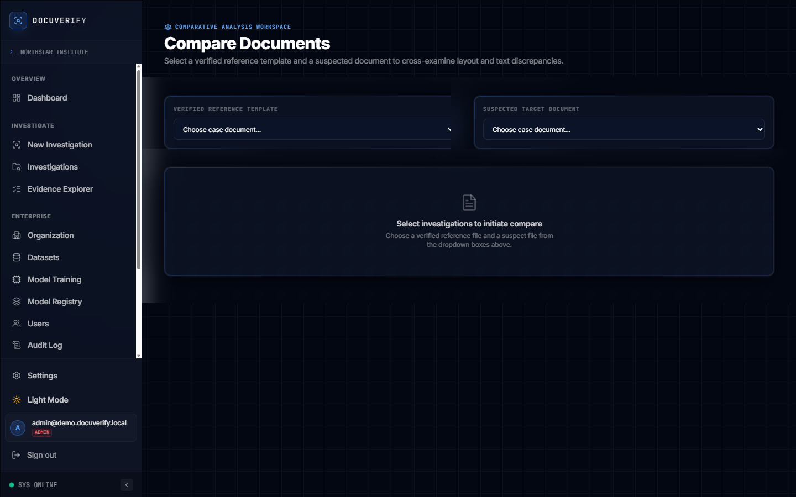
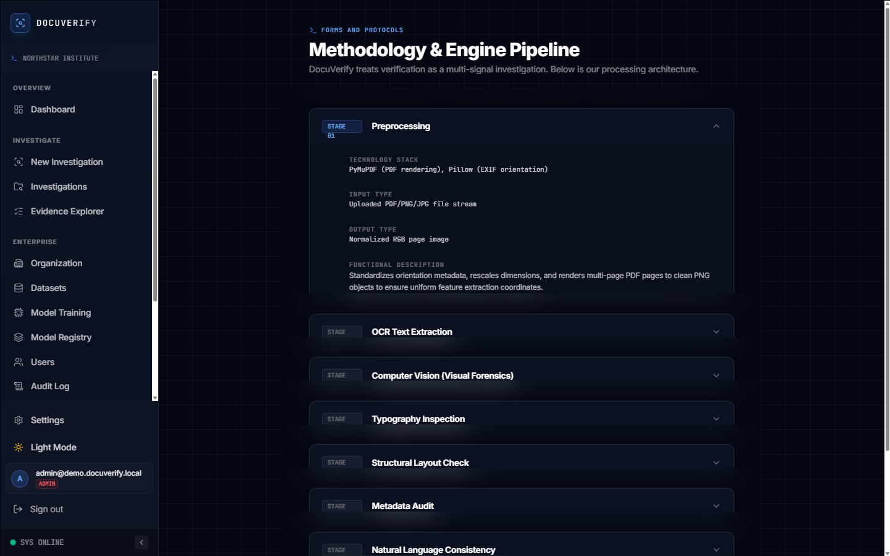
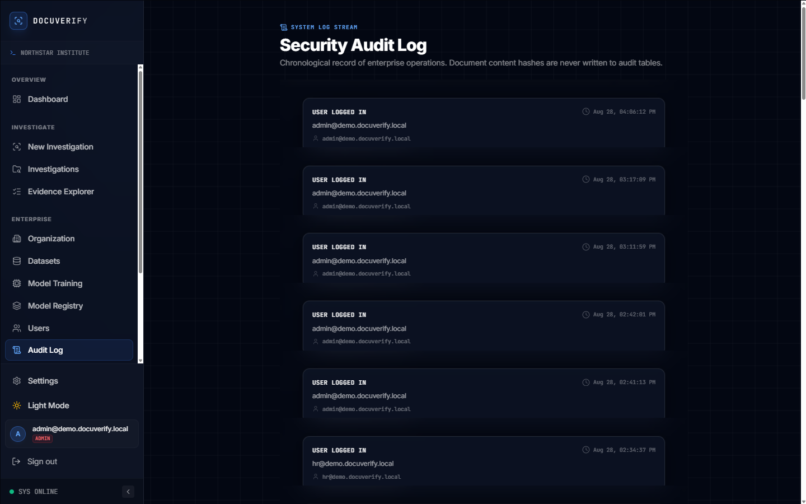
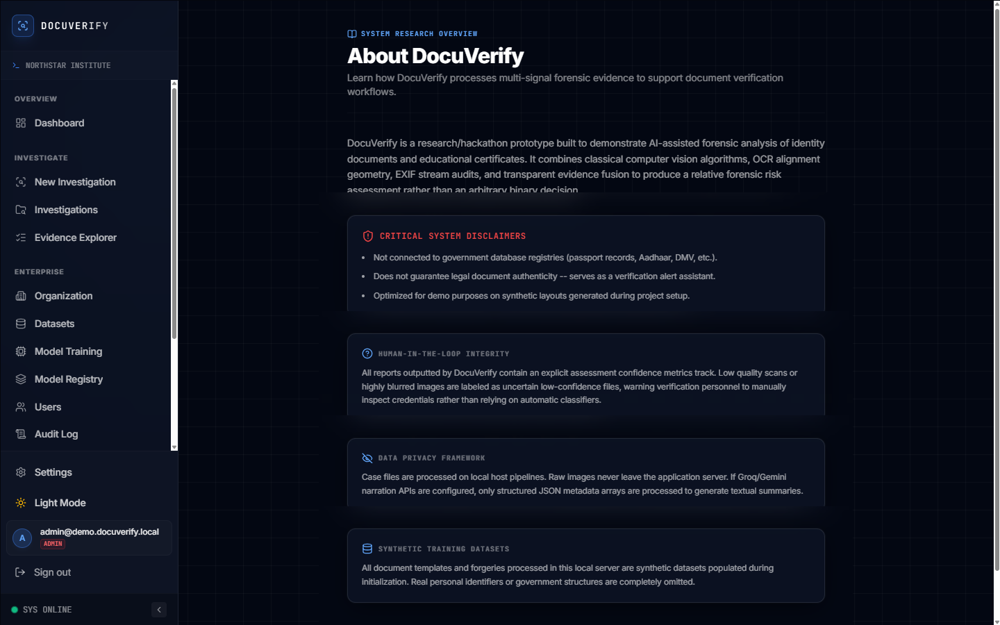

# DocuVerify

### Intelligent Document Authenticity & Forgery Detection

**AI forensic investigation for identity documents and certificates — not a black-box "real/fake" button, but a transparent, explainable, multi-signal forensic engine that shows its work.**

[](LICENSE)


> **This is a hackathon prototype, not an official government verification service.** All identity/certificate documents shipped in this repo are **synthetic and fictional** — no real people, no real institutions, no connection to any government database.

<p align="center">
  
</p>

---

## Table of Contents

1. [The Problem Statement](#1-the-problem-statement)
2. [Our Solution, In One Paragraph](#2-our-solution-in-one-paragraph)
3. [Why This Isn't Just Another Classifier](#3-why-this-isnt-just-another-classifier)
4. [Technology Mapping — Every Required Technology, Traced to Code](#4-technology-mapping--every-required-technology-traced-to-code)
5. [System Architecture](#5-system-architecture)
6. [The Forensic Pipeline, Stage by Stage](#6-the-forensic-pipeline-stage-by-stage)
7. [Evidence Fusion & Scoring](#7-evidence-fusion--scoring)
8. [Explainable AI, Not a Verdict](#8-explainable-ai-not-a-verdict)
9. [Enterprise Adaptive Layer](#9-enterprise-adaptive-layer)
10. [Full UI Walkthrough (Every Screen)](#10-full-ui-walkthrough-every-screen)
11. [Technology Stack](#11-technology-stack)
12. [Project Structure](#12-project-structure)
13. [Security & Multi-Tenancy](#13-security--multi-tenancy)
14. [Honesty, Limitations & Evaluation](#14-honesty-limitations--evaluation)
15. [Getting It Running](#15-getting-it-running)
16. [Demo Script](#16-demo-script)
17. [Roadmap](#17-roadmap)
18. [License & Acknowledgements](#18-license--acknowledgements)

---

## 1. The Problem Statement

This project was built directly against the following hackathon problem statement, reproduced verbatim:

> **DocuVerify: Intelligent Document Authenticity & Forgery Detection**
>
> **Description.** Organizations such as banks, universities, government departments, and employers process large volumes of certificates, identity documents, invoices, and official records. Digitally altered documents can be difficult to distinguish from genuine documents when modifications are subtle. Manual verification is time-consuming and often requires cross-checking multiple visual and textual characteristics.
>
> **The Challenge.** Develop an AI-powered document verification system that analyzes uploaded documents and identifies potential signs of manipulation, inconsistencies, or suspicious alterations. The system should examine document structure, typography, visual elements, metadata when available, and textual consistency to generate an authenticity assessment. It should highlight suspicious regions and explain the factors contributing to its decision rather than providing only a binary result.
>
> **Technologies Used.** Computer Vision, OCR, Document AI, Deep Learning, NLP, Anomaly Detection, Explainable AI.

Every clause in that challenge maps to a specific, working part of this repository — that mapping is the whole point of [§4](#4-technology-mapping--every-required-technology-traced-to-code) below, and nothing in this README describes a capability that isn't actually implemented and runnable today.

## 2. Our Solution, In One Paragraph

DocuVerify treats document verification as a **forensic investigation**, not a classification problem. An uploaded document is run through five independent evidence-gathering engines — visual forensics, typography, structure, metadata, and textual consistency — each of which examines the document the way a human fraud examiner would, and each of which produces its own inspectable score and bounding boxes. Those independent signals are fused with a transparent, documented weighting scheme into three separate numbers (authenticity, forensic risk, and assessment confidence — never conflated into one opaque score), the exact regions that triggered concern are drawn directly on the document image, and a structured explanation is generated that states *what* was found, *where*, *why* it matters, and *how strong* the evidence is — ending in a recommended human check, because the system is built to **assist** a reviewer, never replace one. On top of that general engine, an organization can optionally train a lightweight adaptive model on its own labeled documents (its own certificate template, its own ID card layout) for an organization-tuned second opinion, always shown alongside — never instead of — the general engine's result.

```
Upload → Analyze (5 forensic engines in parallel) → Localize (bounding boxes) →
Fuse (transparent weighted scoring) → Explain (structured, human-readable) →
Assist human verification
```

## 3. Why This Isn't Just Another Classifier

| Most hackathon forgery detectors | DocuVerify |
|---|---|
| One black-box model, one score | 5 independently-inspectable forensic engines, fused transparently |
| "87% fake" and nothing else | Authenticity, Risk, and Confidence reported separately — confidence drops when evidence is thin, it never manufactures risk |
| No indication of *where* the problem is | Every finding is a bounding box rendered on the actual document, click-to-inspect |
| Fixed weights presented as if optimal | Fusion weights are documented and justified in [`docs/methodology.md`](docs/methodology.md); a scoring idea (corroboration bonus) that was tried, measured, and found to *hurt* accuracy is disclosed and disabled rather than hidden — see [`MODEL_CARD.md`](MODEL_CARD.md) |
| One-size-fits-all model | Optional enterprise layer lets each organization train on its *own* document template, additive to (never replacing) the general engine |
| Metrics claimed, not shown | Every number in this README is regenerable from `evaluation/results.json` — nothing is hand-authored |

## 4. Technology Mapping — Every Required Technology, Traced to Code

The problem statement names seven technologies. Here is exactly where each one lives in this codebase — no technology below is claimed without a corresponding, runnable implementation.

| Required Technology | How DocuVerify implements it | Where in the code |
|---|---|---|
| **Computer Vision** | Error Level Analysis (JPEG recompression-artifact detection), noise-residual statistics, edge-sharpness/ringing via Laplacian variance, and copy-move block-matching — each measured against the *document's own* robust median/MAD baseline rather than a fixed global threshold, so a naturally low-quality scan isn't penalized the same way a locally-edited region is. | [`backend/app/services/visual_forensics/`](backend/app/services/visual_forensics) |
| **OCR** | EasyOCR (CRAFT text detector + CRNN sequence recognizer) extracts every text region with its bounding box and confidence score, with a pytesseract fallback if EasyOCR is unavailable. All downstream typography, structure, and consistency analysis is derived from these OCR boxes. | [`backend/app/services/ocr/`](backend/app/services/ocr) |
| **Document AI** | Structural and typographic document understanding: OCR-box geometry is used to evaluate line-spacing regularity and margin conventions (structure), and OCR-box glyph height/ink-density is clustered to detect font-size or weight outliers *within their own cluster* — so a form's label/value font mismatch isn't a false positive. | [`backend/app/services/typography/`](backend/app/services/typography), [`backend/app/services/layout/`](backend/app/services/layout) |
| **Deep Learning** | EasyOCR's CRAFT + CRNN networks are pretrained deep models used for text detection/recognition (used as-is, not retrained). The enterprise adaptive layer trains a RandomForest (or Logistic Regression for very small datasets) classifier on structured forensic feature vectors — we describe this precisely rather than overselling it as deep learning; the full honest breakdown of pretrained-vs-trained-by-us-vs-rule-based is in [`MODEL_CARD.md`](MODEL_CARD.md). | [`backend/app/services/ocr/`](backend/app/services/ocr), [`ml/models/enterprise_classifier.py`](ml/models/enterprise_classifier.py) |
| **NLP** | Regex-driven textual-consistency checks over the OCR'd text: date-relationship sanity checks (e.g. issue date after birth date), repeated-identifier cross-matching, and registration/ID-number consistency across the document. | [`backend/app/services/semantic/`](backend/app/services/semantic) |
| **Anomaly Detection** | Every forensic engine emits a normalized 0–1 anomaly score plus optional bounding boxes into one shared evidence schema, which the fusion stage combines into an overall risk signal — anomalies are scored per-engine and per-region, not just as a single pass/fail flag. | [`backend/app/services/evidence.py`](backend/app/services/evidence.py), [`backend/app/services/fusion/fusion.py`](backend/app/services/fusion/fusion.py) |
| **Explainable AI** | The explanation is built from the *actual strongest evidence item* driving the score (what was found, where, why it matters, how strong, whether other engines corroborate it) — never a templated "score is X% so risk is Y" sentence. Findings are rendered as interactive, click-to-inspect regions on the document with a synchronized evidence drawer. An optional LLM (Groq/Gemini free tier) can narrate the same structured evidence object, but never decides the score or invents findings — the product is fully explainable offline with no LLM configured at all. | [`backend/app/services/explainability/`](backend/app/services/explainability), [`frontend/src/components/EvidenceDrawer.tsx`](frontend/src/components/EvidenceDrawer.tsx), [`frontend/src/components/DocumentViewer.tsx`](frontend/src/components/DocumentViewer.tsx) |

Also directly addressed from the problem description, beyond the technology list:

- **"examine document structure, typography, visual elements, metadata when available, and textual consistency"** — these are the five forensic engines, verbatim, each with its own scored stage in the pipeline (§6).
- **"metadata when available"** — EXIF (images) / document-info dictionary (PDFs) is inspected when present; **missing metadata is reported neutrally, never treated as suspicious**, because its absence is common in legitimately re-saved documents.
- **"highlight suspicious regions"** — every visual/typography/structure/consistency finding with a bounding box is drawn directly on the document in the [Document Evidence Map](#10-full-ui-walkthrough-every-screen).
- **"explain the factors contributing to its decision rather than providing only a binary result"** — three separate numbers (authenticity / risk / confidence), a ranked findings list, and a structured WHAT/WHERE/WHY/HOW-strong explanation — never a single fake/genuine binary.

## 5. System Architecture

```
                              ┌─────────────────────────────┐
                              │        REACT FRONTEND        │
                              │  Quick Scan · Forensic Mode   │
                              │  Evidence Map · Explorer      │
                              │  Enterprise Console           │
                              └───────────────┬───────────────┘
                                              │ REST (JWT)
                              ┌───────────────▼───────────────┐
                              │         FASTAPI BACKEND        │
                              │  routes · auth · enterprise     │
                              └───────────────┬───────────────┘
                                              │
        ┌─────────────────────────────────────┼─────────────────────────────────────┐
        │                                     │                                     │
┌───────▼────────┐                  ┌─────────▼─────────┐                 ┌─────────▼─────────┐
│  OCR ENGINE      │                 │  FORENSIC ENGINES   │                │  ENTERPRISE LAYER   │
│  EasyOCR          │                │  Visual · Typography │                │  Dataset validation  │
│  (CRAFT + CRNN)    │                │  Structure · Metadata │               │  RandomForest / LR    │
│                     │               │  NLP Consistency       │              │  training + registry   │
└───────┬────────────┘                └─────────┬───────────┘                └─────────┬─────────────┘
        │                                        │                                      │
        └───────────────────┬────────────────────┘                                      │
                             ▼                                                           │
                  ┌─────────────────────┐                                                │
                  │   EVIDENCE FUSION     │◄──────────────────────────────────────────────┘
                  │  weighted scoring       │   (additive, org-tuned second opinion)
                  └──────────┬───────────┘
                             ▼
                  ┌─────────────────────┐
                  │  EXPLAINABLE REPORT   │
                  │  score · regions ·     │
                  │  WHAT/WHY/HOW-strong    │
                  └─────────────────────┘
```

**Backend** (`backend/app/`): FastAPI app split into `api/` (routers), `services/` (one module per forensic engine + fusion + explanation), `models/` (SQLAlchemy schema), `core/` (config, security, DB).
**Frontend** (`frontend/src/`): React + TypeScript + Vite + Tailwind, with `pages/` for route-level screens, `components/` for the document viewer / evidence drawer / score cards, `auth/` for the JWT context and route guards.
**ML code** (`ml/`): deliberately kept at the repo root, separate from `backend/`, so the enterprise training/inference pipeline has no hard dependency on the FastAPI process and can be run standalone.

Full stage-by-stage detail in [`docs/architecture.md`](docs/architecture.md); fusion-weight rationale in [`docs/methodology.md`](docs/methodology.md).

## 6. The Forensic Pipeline, Stage by Stage

Both product modes ([Quick Scan](#10-full-ui-walkthrough-every-screen) and [Forensic Investigation](#10-full-ui-walkthrough-every-screen)) call the **exact same** backend stage functions — `analyze_document_intake`, `analyze_ocr`, `analyze_visual_forensics`, `analyze_typography_stage`, `analyze_structure`, `analyze_metadata_stage`, `analyze_consistency_stage`, `fuse_and_assess` — in [`backend/app/services/pipeline.py`](backend/app/services/pipeline.py). Only the frontend orchestration/reveal differs.

| # | Stage | What it examines | Output |
|---|---|---|---|
| 1 | **Document Intake** | File type, page count, EXIF/doc-info presence, perspective correction | Normalized document object |
| 2 | **OCR** | Every text region via EasyOCR (CRAFT + CRNN) | Text + bounding boxes + confidence |
| 3 | **Visual Forensics** | ELA, noise residual, edge-sharpness/ringing, copy-move | Anomaly score + region boxes |
| 4 | **Typography** | Glyph height & ink-density clustering | Font-outlier findings |
| 5 | **Structure** | Line-spacing & margin geometry from OCR boxes | Layout-anomaly findings |
| 6 | **Metadata** | EXIF / PDF doc-info, editor-software fingerprints | Metadata findings (neutral if absent) |
| 7 | **Textual Consistency** | Date logic, repeated identifiers, cross-field checks | NLP consistency findings |
| 8 | **Evidence Fusion** | Combines all of the above | Authenticity / Risk / Confidence |

## 7. Evidence Fusion & Scoring

Fusion is a **fixed, documented weighted average** (`app/services/fusion/fusion.py`) — not a black box:

```
visual 0.30 · semantic (NLP consistency) 0.25 · typography 0.20 · structure 0.15 · metadata 0.10
```

Three numbers are always reported, never conflated into one:

- **Authenticity (0–100)** — evidence supporting the document is genuine.
- **Forensic Risk (0–100)** — the complementary risk view, shown explicitly, not just implied by "100 − authenticity."
- **Assessment Confidence (0–100)** — how much of the *possible* evidence weight actually produced a signal. A blurry scan that starves OCR (and everything downstream of it) lowers confidence — it does **not** manufacture risk.

A "corroboration bonus" (extra weight when two engines flag overlapping regions) was implemented, measured on the evaluation set, found to **hurt** discrimination, and disabled — told straight in [`MODEL_CARD.md`](MODEL_CARD.md) rather than quietly dropped. An optional trained Logistic Regression fusion alternative exists (`scripts/train_fusion_model.py`) but is not the production default.

## 8. Explainable AI, Not a Verdict

<p align="center">
  
</p>

Every finding with a bounding box is rendered as a color-coded, clickable overlay directly on the document. Clicking a region — or a matching entry in the findings list — opens an evidence drawer with the finding's **type, severity, confidence, what was found, why it matters, and a recommended human check**, synchronized so either view highlights the other. The generated explanation is always built from the *actual strongest evidence item*, not a generic score-to-sentence template. If an LLM provider is configured (`LLM_PROVIDER`/`LLM_API_KEY`, optional, free-tier Groq/Gemini supported), it narrates that same structured evidence object in natural language — it never independently decides authenticity and never invents a finding the pipeline didn't produce. With no LLM configured, a deterministic template runs instead, so the product works fully offline either way.

## 9. Enterprise Adaptive Layer

```
BASE FORENSIC ENGINE (runs on every document, always)
   ↓
9-FEATURE VECTOR  (derived from OCR / visual / typography / structure / metadata / NLP signals)
   ↓
ORGANIZATION DATASET  (admin-uploaded ZIP: genuine/ + forged/ + optional metadata.csv)
   ↓
VALIDATION  (safe extraction, corruption check, class-balance check — checklist UI, never a crash)
   ↓
TRAINING  (RandomForest, or Logistic Regression for very small datasets) — real staged progress,
           not a simulated bar: dataset prep → feature extraction → split → train → evaluate → package
   ↓
MODEL REGISTRY  (every version stored with algorithm, dataset, metrics, status)
   ↓
ADMIN ACTIVATES A VERSION  (archives the previously-active one; rollback = re-activate an older version)
   ↓
HR/VERIFIER SEES BOTH NUMBERS  (base engine result + organization model result, side by side — additive, never a silent replacement)
```

The classifier consumes exactly the same structured features the base pipeline already computes for every document ([`ml/training/feature_extractor.py`](ml/training/feature_extractor.py)) — it does not retrain OCR or any pretrained component. Full pipeline and code map in [`docs/enterprise_training.md`](docs/enterprise_training.md).

## 10. Full UI Walkthrough (Every Screen)

Every screenshot below is a real capture of the running application (not a mockup) — see [`docs/screenshots/`](docs/screenshots) for the source files.

### Landing & Authentication

| Landing | Login | Register |
|---|---|---|
|  |  |  |

### Core Investigation Workflow

**Dashboard** — organization-wide stats and recent investigations at a glance.


**New Investigation** — upload a document and choose Quick Scan or Forensic Investigation mode.


**Live Analysis** — the real-time forensic pipeline console, showing every stage as it actually executes (Document Intake → OCR → Visual Forensics → Typography → Structure → Metadata → Consistency → Evidence Fusion).


**Forensic Investigation Mode** — a manual, step-by-step workspace with a persistent timeline; each stage shows its own real result and can be revisited.


**Report — Overall Assessment** — authenticity, risk, and confidence, plus the recommended human checks and technical details.


**Report — Document Evidence Map** — the document with clickable bounding boxes, the ranked findings list, and score gauges together.


### Investigation Management

| Investigation History | Evidence Explorer | Document Comparison |
|---|---|---|
|  |  |  |

**Methodology** — an in-app page explaining the fusion weights and scoring approach to a non-technical reviewer.


### Enterprise Console (Admin)

**Enterprise Dashboard** — organization analytics and model status.


| Dataset Management | Model Training (real progress) | Model Registry |
|---|---|---|
|  |  |  |

**Audit Log** — every admin action recorded (who did what, never document contents).


**About** — project context and responsible-AI framing shown in-product.


## 11. Technology Stack

**Backend:** FastAPI · SQLAlchemy + SQLite · OpenCV · PyMuPDF · EasyOCR · scikit-learn · PyJWT · joblib
**Frontend:** React · Vite · TypeScript · Tailwind CSS · Framer Motion · React Router
**ML:** classical computer vision + OCR-derived statistical features (rule/feature-based engines) + RandomForest/Logistic Regression (scikit-learn) for the enterprise adaptive layer

## 12. Project Structure

```
DocuVerify/
├── backend/app/{api,core,models,schemas,services}   FastAPI app
│   └── services/{ocr,visual_forensics,typography,structure,metadata,consistency,fusion,explanation,enterprise}
├── ml/{models,training,inference}                    enterprise classifier (repo-root, framework-independent)
├── frontend/src/{pages,pages/enterprise,components,layout,auth,api}
├── scripts/            dataset gen, split, forgery gen, evaluation, fusion training, setup_demo.py
├── demo_datasets/       enterprise demo ZIP + its generator
├── data/{synthetic,raw,uploads,enterprise}            (enterprise/ + uploads/ gitignored)
├── evaluation/          real evaluation results
├── demo/                curated sample documents
├── docs/{architecture,methodology,enterprise_training,demo}.md, docs/screenshots/
├── README.md, DATASETS.md, MODEL_CARD.md, SECURITY.md, FINAL_REPORT.md
```

## 13. Security & Multi-Tenancy

- Passwords hashed with **PBKDF2-HMAC-SHA256** (200,000 iterations, per-user random salt) — never stored in plaintext.
- Short-lived (12h) **JWTs** signed with a secret generated once per install.
- **Server-side** role enforcement (`require_admin` dependency on every enterprise route) — an HR account calling an admin endpoint directly gets a 403, not just a hidden menu item.
- Every enterprise record carries an `organization_id`; a document/report guard (`_get_authorized_document` in `app/api/deps.py`) prevents one organization from ever reading another's data.
- Safe ZIP extraction for dataset uploads (path-traversal guard, extension allowlist, size/count caps); randomized upload filenames.
- Full honest threat model — including what this build deliberately does *not* harden (no forgot-password flow, no token revocation list, permissive CORS for demo convenience) — in [`SECURITY.md`](SECURITY.md).

## 14. Honesty, Limitations & Evaluation

Every metric in this repository is regenerated from live code, not hand-authored:

- Fusion ROC-AUC is a real-but-modest **~0.56** on the core forensic test set; the enterprise classifier scores meaningfully better (**F1 ~71%, ROC-AUC ~0.67**) on its own narrower, single-template dataset — expected, since one organization's documents are far more homogeneous than a cross-category benchmark, not a claim the general engine itself improved.
- Evaluated only on this project's own synthetic dataset — not validated on real-world scans or photographs.
- English-only OCR/text heuristics; no connection to any real government database (by design).
- Two experimental visual detectors (`copy_move.py`, `jpeg_blockiness.py`) exist in the codebase but are intentionally unwired due to high false-positive rates — documented as future work rather than shipped half-validated.

Full numbers in [`evaluation/report.md`](evaluation/report.md) / [`evaluation/results.json`](evaluation/results.json); full honesty breakdown of pretrained-vs-trained-by-us-vs-rule-based in [`MODEL_CARD.md`](MODEL_CARD.md).

## 15. Getting It Running

### Backend
```bash
cd backend
python -m venv venv
venv\Scripts\activate          # Windows; `source venv/bin/activate` on macOS/Linux
pip install -r requirements.txt
uvicorn app.main:app --reload --port 8000
```
API at `http://localhost:8000` (interactive docs at `/docs`). First run creates a fresh SQLite DB automatically.

### Frontend
```bash
cd frontend
npm install
npm run dev
```
Open `http://localhost:5173`.

### Generate the demo dataset & run the full demo
```bash
python scripts/generate_synthetic_documents.py --count 40
python scripts/generate_forgeries.py
python scripts/prepare_datasets.py
python scripts/setup_demo.py   # backend must already be running
```

| Role | Email | Password |
|---|---|---|
| Admin | `admin@demo.docuverify.local` | `demopass123` |
| HR | `hr@demo.docuverify.local` | `demopass123` |

Unauthenticated use is also fully supported — the core forensic pipeline (no enterprise model) works without logging in at all.

## 16. Demo Script

Full ~3–5 minute walkthrough in [`docs/demo.md`](docs/demo.md): Admin login → Enterprise Dashboard → upload/validate a dataset → train with real progress → activate a model → HR login → New Investigation → Forensic Investigation stage-by-stage → Evidence Map → click a region → drawer → Overall Assessment (base engine vs. organization model, side by side) → Investigation History.

## 17. Roadmap

Calibrate fusion weights on a larger dataset · wire the unshipped copy-move/JPEG-blockiness detectors after reducing false positives · portrait-substitution detection · multi-page analysis · forgot-password flow · token revocation · background job queue instead of a raw thread for training · cross-organization model comparison · hash-based provenance/fingerprint registry.

## 18. License & Acknowledgements

[MIT License](LICENSE). Built for a hackathon by [ethical0101](https://github.com/ethical0101). Powered by EasyOCR, OpenCV, scikit-learn, FastAPI, and React/Vite/Tailwind — see [§11](#11-technology-stack).

**DocuVerify never claims to be an official verification service or a guarantee of fraud detection.** Every result is framed as a forensic risk assessment requiring human verification — never a bare "100% fake" or "guaranteed forgery."
